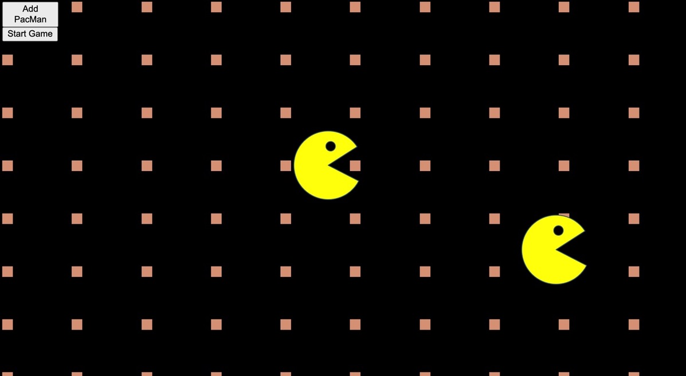

<h1 align="center">Welcome to pac-men-factory 👋</h1>

<p>
  <a href="#" target="_blank">
    
  </a>
  <a href="https://twitter.com/duffmancode" target="_blank">
    
  </a>
</p>

> Factory to make a PacMan at a random position with random velocity. Loop over pacmen array and move each one and move image in DOM.

## Usage

```sh
Click &#34;Add PacMan&#34; to add a new PacMan to the screen.  Add as many as you like.  Click Start Game and the PacMen will begin to move at random speeds and directions.
```

## Roadmap

Will update to eat food and turn Pac-Men to face to the left, currently only facing to the right.

## License

Distributed under the MIT License. See `LICENSE` for more information.

## Author

👤 **Brendan Duffy**

* Website: www.webdevduffy.com
* Twitter: [@duffmancode](https://twitter.com/duffmancode)
* Github: [@thewalkingduff](https://github.com/thewalkingduff)
* LinkedIn: [@devduffy](https://linkedin.com/in/devduffy)

## Show your support

Give a ⭐️ if this project helped you!

***
_This README was generated with ❤️ by [readme-md-generator](https://github.com/kefranabg/readme-md-generator)_# pac-men-factory
